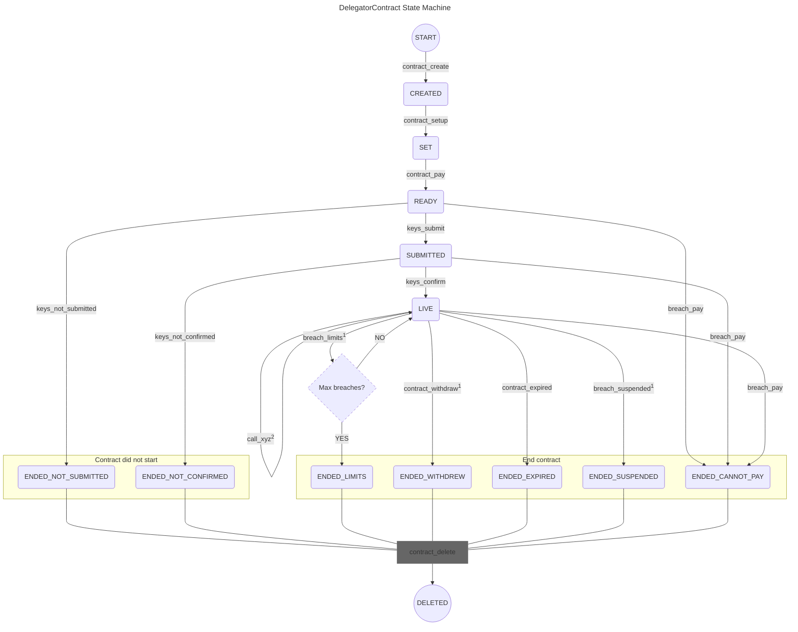

# State Machine of DelegatorContract

This file visualizes the state machine of the [DelegatorContract](/smart_contracts/delegator_contract/contract.py) and describes the actions that can be taken.

# Notes:
(*)Any action that fails maintains the last state.

(**)Call of any action fails if not called from the state where it is explicitly allowed.

(1) Fails if contract is already expired.

(2)Possible actions are:

- `contract_claim`
- `contract_report_expiry_soon`1

# List of actions

Below is a list of all possible actions to transition between states.
A description of each action is added.

- `contract_create`:  
Requires as input: a manager address, a beneficiary address, and the `Noticeboard` app ID.  
Creates the delegation contract.  
Sets as the delegation beneficiary address (`del_beneficiary`) the address given in the input.  
Sets as the delegation manager address (`del_manager`) the address given in the input.
Sets the app ID of the `Noticeboard` platform as given in the input.  
Sets the app ID of the `ValidatorAd` to the caller application.  
Changes the contract state to `CREATED`.  
Returns: the created delegator contract app ID.  

- `contract_setup`:  
Requires as input: sha256 of terms and conditions, general delegation terms, balance delegation terms, and contract duration.  
Succeeds only if called by the contract creator.  
Fails if not called from `CREATED` state.  
Sets the sha256 of the terms and conditions of the delegation contract (`tc_sha256`).  
Sets the general delegation terms of the delegation contract (`delegation_terms_general`).  
Sets the balance delegation terms of the delegation contract (`delegation_terms_balance`).  
Sets the `round_start` to the current round.  
Sets the `round_end` to the current round plus the agreed contract duration.  
Set the `round_claim_last` to the start round.
Calculates and sets the `fee_operational`.  
Calculates and sets the `fee_operational_partner`.  
Opts into the asset given in the delegation terms if it is not ALGO.  
Changes the contract state to `SET`.  
Returns: nothing.  

- `contract_pay`:  
Requires as input: a transaction.  
Succeeds only if called by the contract creator.  
Fails if not called from `SET` state.  
Fails if the input transaction is neither an ALGO payment nor ASA transfer transaction to this contract.  
Fails if the input transaction does not match the asset defined in the delegation terms (`fee_asset_id`).  
Fails if the sent amount does not equal the sum of the required setup fee (`fee_setup`) and operational fee (`fee_operational`) as well as the partner fees (`fee_setup_partner` and `fee_operational_partner`).  
Fails if delegation beneficiary address (`del_beneficiary`) does not meet agreed balance limits.
Changes the contract state to `READY`.  
Returns: nothing.  

- `keys_confirm`:  
Requires as input: manager address.  
Succeeds only if called by the contract creator.  
Fails if not called from `SUBMITTED` state.  
Fails if the manager address given in the input does not equal the delegator manager account.  
Succeeds only if less than the sum of the agreed maximum number of rounds for setup (`rounds_setup`) and for confirmation (`rounds_confirm`) as per the delegation terms have passed since the contract start (`round_start`).  
Checks that the beneficiary address has opted into its performance tracking within the consensus.  
Sets last breach round (`round_breach_last`) to the current round.  
Resets number of breaches (`cnt_breach_del`) to zero.  
Changes the contract state to `LIVE`.  
Returns: nothing.  

- `keys_not_confirmed`:  
Requires as input: nothing.  
Succeeds only if called by the contract creator.  
Fails if not called from `SUBMITTED` state.  
Reports that the keys have not been confirmed.  
Succeeds only if less than the sum of the agreed maximum number of rounds for setup (`rounds_setup`) and for confirmation (`rounds_confirm`) have passed since the contract start (`round_start`).  
Checks if the delegator contract manager can accept the asset (`fee_asset_id`).  
If yes, the agreed operational fee (`fee_operational`) and the corresponding partner fee (`fee_operational_partner`) as per the delegation terms is sent to the delegator contract manager.
*Gracefully handle the case if the fee was clawed back by the asset manager.*  
*If no, all the remaining balance is claimed by the delegator contract manager at contract deletion.*  
Changes the contract state to `ENDED_NOT_CONFIRMED`.  
*Marks the actual end round of the contract `round_ended`*.  
Define notification message for this action.  
Returns: delegator manager address and the notification message.  

- `keys_not_submitted`:  
Requires as input: nothing.  
Succeeds only if called by the contract creator.  
Fails if not called from `READY` state.  
Reports that keys have not been submitted.  
Succeeds only if more than the agreed maximum number of rounds for setup (`rounds_setup`) as per the delegation terms have passed since the contract start (`round_start`).  
Checks if the delegator contract manager can accept the asset (`fee_asset_id`).  
If yes, the agreed setup fee (`fee_setup`) and operational fee (`fee_operational`) and the corresponding partner fees (`fee_setup_partner` and `fee_operational_partner`) as per the delegation terms are sent to the delegator contract manager.
*Gracefully handle the case if the fee was clawed back by the asset manager.*  
*If no, all the remaining balance is claimed by the delegator contract manager at contract deletion.*  
Changes the contract state to `ENDED_NOT_SUBMITTED`.  
*Marks the actual end round of the contract `round_ended`*.  
Define notification message for this action.  
Returns: delegator manager address and the notification message.  

- `keys_submit`:  
Requires as input: key registration info.  
Succeeds only if called by the contract creator.  
Fails if not called from `READY` state.  
Submits the generated participation key information to the delegation contract (`part_keys_info`).  
Succeeds only if less than the agreed maximum number of rounds for setup (`rounds_setup`) as per the delegation terms have passed since the contract start (`round_start`).  
Calls `_distribute_earnings`.
Provides as input: the agreed setup fee (`fee_setup`) and the corresponding partner fee (`fee_setup_partner`) as per the delegation terms.
Distributes the setup fee to the validator ad and `Noticeboard`.
Receives: setup fee amount minus commission, paid commission amount, and its asset type (i.e. ASA ID or ALGO).  
Changes the contract state to `SUBMITTED`.  
Define notification message for this action.  
Returns: setup fee amount minus commission, paid commission amount, and its asset type (i.e. ASA ID or ALGO), and delegator manager address and the notification message.  

- `breach_limits`:  
Requires as input: nothing.  
Succeeds only if called by the contract creator.  
Fails if not called from `LIVE` state.  
Fails if contract is already expired.  
Fails if current round number is less than the sum of the round number of the last breach event `round_breach_last` and the agreed minimum time between two breaches to consider them separate (`rounds_breach`) as per the delegation terms.  
Checks if the delegation beneficiary (`del_beneficiary`) ALGO balance is below the agreed maximum (i.e.`stake_max`)
Checks for each ASA in the agreed list (`gating_asa_list`) as per the delegation terms if its balance is above the agreed minimum as per the delegation terms.  
If all balances are sufficient, the action fails.  
Otherwise, the number of breaches is incremented by one and the round number of the last breach event `round_breach_last` set to the current round.  
..... ..... .....  
Calls `contract_claim`.
Provides as input: nothing.
Claims assets up to this round.
Receives: claimed operational fee amount minus commission, paid commission amount, and its asset type (i.e. ASA ID or ALGO).  
If number of breach is above the agreed maximum (`cnt_breach_del_max`), marks that maximum number of breaches has been reached.  
*Marks the actual end round of the contract `round_ended`*.  
Changes the contract state to `ENDED_LIMITS`.  
..... ..... .....  
Define notification message for this action based whether the maximum breaches was reached or not.  
Returns: boolean marking if maximum number of breaches has been reached, claimed operational fee amount minus commission, paid commission amount, and its asset type (i.e. ASA ID or ALGO), delegator manager address and the notification message.  

- `breach_pay`:  
Requires as input: nothing.  
Succeeds only if called by the contract creator.  
Fails if not called from `LIVE` or `SUBMITTED` or `READY` state.  
Fails if the agreed asset type is ALGO *(because it is not possible to freeze or clawback ALGO)*.  
If this delegator contract address has the agreed asset type (i.e. ASA ID) frozen, approve the call.  
If called from `READY` state, succeeds only if the balance of the agreed asset type (i.e. ASA ID) is lower than the sum of the agreed setup fee (`fee_setup`) and full operational fee (`fee_operational`) and the corresponding partner fees (`fee_setup_partner` and `fee_operational_partner`).  
If called from `SUBMITTED` state, succeeds only if the balance of the agreed asset type (i.e. ASA ID) is lower than the agreed full operational fee (`fee_operational`) and the corresponding partner fee (`fee_operational_partner`).  
If called from `LIVE` state, succeeds only if the balance of the agreed asset type (i.e. ASA ID) is lower than the calculated operational fee earned since last claim time (i.e. (min(`round_current`,`round_end`)-`round_claim_last`)\*`fee_round` and the corresponding partner fee, i.e. (min(`round_current`,`round_end`)-`round_claim_last`)\*`fee_round_partner`).  
*Marks the actual end round of the contract `round_ended`*.  
Changes the contract state to `ENDED_CANNOT_PAY`.  
Define notification message for this action.  
Returns: delegator manager address and the notification message.  

- `breach_suspended`:  
Requires as input: nothing.  
Succeeds only if called by the contract creator.  
Fails if not called from `LIVE` state.  
Fails if contract is already expired.  
Checks if delegator beneficiary was suspended by consensus.  
Calls `contract_claim`.
Provides as input: nothing.
Claims assets up to this round.
Receives: claimed operational fee amount minus commission, paid commission amount, and its asset type (i.e. ASA ID or ALGO).  
*Marks the actual end round of the contract `round_ended`*.  
Changes the contract state to `ENDED_SUSPENDED`.  
Define notification message for this action.  
Returns: claimed operational fee amount minus commission, paid commission amount, and its asset type (i.e. ASA ID or ALGO), delegator manager address and the notification message.  

- `contract_claim`:  
Requires as input: nothing.  
Succeeds only if called by the contract creator.  
Fails if not called from `LIVE` state.  
Checks when was the last time the operational fee was claimed (`round_claim_last`).  
Calculates the operational fee earned since last claim time (i.e. (`round_current`-`round_claim_last`)\*`fee_round`) and the corresponding partner fee (i.e. (`round_current`-`round_claim_last`)\*`fee_round_partner`).  
Calls `_distribute_earnings`.
Provides as input: the operational fee earned and the corresponding partner fee.
Distributes the operational fee earned to the validator ad and `Noticeboard` as well as the partner fee.
Receives: claimed operational fee amount minus commission, paid commission amount, and its asset type (i.e. ASA ID or ALGO).  
Updates the last time the operational fee was claimed to the current round.  
Returns: claimed operational fee amount minus commission, paid commission amount, and its asset type (i.e. ASA ID or ALGO).  

- `_distribute_earnings`:  
*A private method.*  
Requires as input: amount and partner amount.  
Fails if the sum of amount and partner amount is not available on the platform *(happens only if the amount was clawed back by the asset manager)*.  
Fails if this delegator contract address has the agreed asset type (i.e. ASA ID) frozen.  
Checks if validator ad can accept the agreed asset type (i.e. ASA ID or ALGO).
*This needs to also check if the address ad has the asset frozen.*
If yes, sends to the validator ad address the amount minus the agreed commission for the platform.  
Checks if the `Noticeboard` can accept the agreed asset type (i.e. ASA ID or ALGO).
*This needs to also check if the address has the asset frozen.*
If yes, sends to the `Noticeboard` address the commission.  
Checks if partner address can accept the agreed asset type (i.e. ASA ID or ALGO).
*This needs to also check if the partner address has the asset frozen and fulfills account MBR.*
If yes, sends to the partner address the partner amount.  
Returns: amount minus commission, commission amount, and its asset type (i.e. ASA ID or ALGO).  

- `contract_expired`:  
Requires as input: nothing.  
Succeeds only if called by the contract creator.  
Fails if not called from `LIVE` state.  
Fails if contract has not yet expired.  
Calls `contract_claim`.
Provides as input: nothing.
Claims assets up to this round.
Receives: claimed operational fee amount minus commission, paid commission amount, and its asset type (i.e. ASA ID or ALGO).  
*Marks the actual end round of the contract `round_ended`*.  
Changes the contract state to `ENDED_EXPIRED`.  
Define notification message for this action.  
Returns: claimed operational fee amount minus commission, paid commission amount, and its asset type (i.e. ASA ID or ALGO), delegator manager address and the notification message.  

- `contract_withdraw`:  
Requires as input: manager address.  
Succeeds only if called by the contract creator.  
Fails if not called from `LIVE` state.  
Fails if the manager address given in the input does not equal the delegator manager account.  
Fails if contract is already expired.  
Calls `contract_claim`.
Provides as input: nothing.
Claims assets up to this round.
Receives: claimed operational fee amount minus commission, paid commission amount, and its asset type (i.e. ASA ID or ALGO).  
*Marks the actual end round of the contract `round_ended`*.  
Changes the contract state to `ENDED_WITHDREW`.  
Returns: claimed operational fee amount minus commission, paid commission amount, and its asset type (i.e. ASA ID or ALGO).  
*Note: Delegator beneficiary should issue a key deregistration transaction 320 rounds before this call to prevent the account being kicked out from the protocol if the validator deletes the keys right away - because it is not obliged to continue servicing them.*

- `contract_delete`:  
Requires as input: manager address.  
Succeeds only if called by the contract creator.  
Fails if not called from any `ENDED_xyz` state.  
Fails if the manager address given in the input does not equal the delegator manager account.  
Sends any remaining balance (minus sent MBR in case of ALGO) of the asset type (i.e. ASA ID or ALGO) to the delegator manager account.
If the asset type is an ASA, sends a close out transaction to the delegator manager account.  
Closes out the contract account.  
Deletes the contract.  
Returns: remaining available balance that was returned, and its asset type (i.e. ASA ID or ALGO).  

- `contract_report_expiry_soon`:  
Requires as input: how much before expiry can the notification be made, and how often can it be repeated.  
Succeeds only if called by the contract creator.  
Fails if not called from `LIVE` state.  
Fails if the time until planned contract end (`round_end`) is larger than the one defined in the input.  
Fails if the time since last report of expiry (`round_expiry_soon_last`) is larger than the one defined in the input.  
Fails if contract has already expired.  
Define notification message for this action.  
Returns: delegator manager address and the notification message.  
