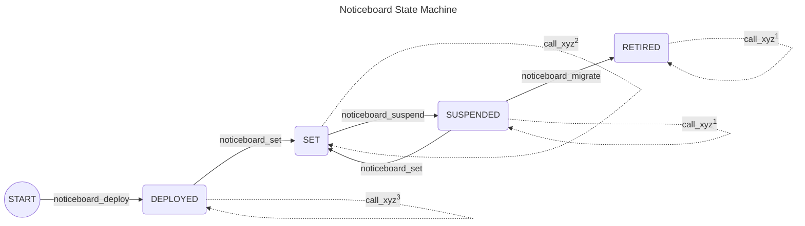

# State Machine of Noticeboard

This file visualizes the state machine of the [Noticeboard](/smart_contracts/noticeboard/contract.py) and describes the actions that can be taken.

# Notes:
(*)Any action that fails maintains the last state.

(**)Call of any action fails if not called from the state where it is explicitly allowed.

(1)Possible actions are:

[//]: # (For platform manager)
- `noticeboard_key_reg`
- `noticeboard_income`
- `noticeboard_optin_asa`
- `partner_config`

[//]: # (For validator)
- `ad_config`
- `ad_delete`
- `ad_ready`
- `ad_income`
- `ad_asa_close`
- `keys_submit`

[//]: # (For delegator)
- `contract_delete`
- `contract_withdraw`
- `keys_confirm`

[//]: # (For anyone)
- `breach_dereg`
- `breach_limits`
- `breach_pay`
- `breach_suspended`
- `contract_claim`
- `contract_expired`
- `keys_not_confirmed`
- `keys_not_submitted`
- `user_delete`

(2)Possible actions are:

- all from (1)

[//]: # (For platform manager)
- `noticeboard_config_asset`

[//]: # (For new validator)
- `ad_create`

[//]: # (For existing validator)
- `ad_self_disclose`
- `ad_terms`

[//]: # (For new delegator)
- `contract_create`

[//]: # (For anyone)
- `user_create`

(3)Possible actions are:

[//]: # (For platform manager)
- `noticeboard_key_reg`
- `noticeboard_income`
- `noticeboard_optin_asa`
- `template_load_init`
- `template_load_data`
- `partner_config`

# List of actions

Below is a list of all possible actions to transition between states.
A description of each action is added.

- `noticeboard_deploy`:  
Requires as input: previous app version.  
Deploys the main smart contract of the platform.  
Sets the platforms previous app version based on the input.  
The smart contract creator becomes the platform manager.  
Sets the contract state to `DEPLOYED`.  
Returns: the created noticeboard app ID.  

- `noticeboard_suspend`:  
Requires as input: nothing.  
Succeeds only if called by the platform manager or contract creator.  
Fails if not called from `SET` state.  
This will suspend creation of new validator ads and modification of existing ones, as well as creation of new delegation contracts and registration of new users.
*Note: The contract creator has the explicit right to suspend the contract to have a fail-safe mechanism to suspend parts of its functionality in case of legal issues and a breached platform manager.*  
Sets the contract state to `SUSPENDED`.  
Returns: nothing.  

- `noticeboard_migrate`:  
Requires as input: app ID of new platform version.  
Succeeds only if called by the platform manager or contract creator.  
Fails if not called from `SUSPENDED` state.  
Sets the ID of the new app version of this platform.
This will retire the current platform, permanently preventing creation of new validator ad and modification of existing ones, as well as creation of new delegation contracts and registration of new users.
Since retired platform cannot create new validator ads or modify existing ones, configuring payment assets and partners is not needed anymore.  
*Note: The migration is just a convenience mechanism, it does not matter if the contract creator address were to be compromised because a new platform instance could simply be deployed with a new address. The contract creator has the explicit right to retire the contract to have a fail-safe mechanism to disable parts of its functionality in case of legal issues and a breached platform manager.*  
Sets the contract state to `RETIRED`.  
Returns: nothing.  

- `noticeboard_set`:  
Requires as input: (new) platform manager, (new) asset config manager, (new) platform's commission percentage, (new) validator setup fee, (new) validator user registration fee, (new) delegator user registration fee, (new) contract terms, and (new) validator ad smart contract template.  
Succeeds only if called by the current platform manager or contract creator.  
Fails if called from `RETIRED` state.  
Sets (anew) the platform manager address, the asset config manager, platform's commission percentage, validator setup fee, validator user registration fee, delegator user registration fee, and the validator ad smart contract template.   
Performs sanity checks on the given parameters.  
Sets the contract state to `SET`.  
Returns: nothing.  
*Note: for storing the validator ad smart contract template, the MBR must be paid.*

- `noticeboard_key_reg`:  
Requires as input: participation key information, and ALGO payment transaction.  
Succeeds only if called by the platform manager.  
Registers the the noticeboard address in network consensus with the given participation key information.  
Checks if the payment transaction is to this contract.  
The payment amount is used as the fee for issuing the key (de)registration transaction.
*This allows covering consensus participation fee even upon suspension.*  
Returns: nothing.  

- `noticeboard_optin_asa`:  
Requires as input: ASA ID, and ALGO payment transaction.  
Succeeds only if called by the platform manager or asset config manager.  
Opts the platform address in to the ASA.  
MUST be accompanied by a payment for the MBR increase.  
Returns: nothing.  
*Note: The platform cannot opt out of an ASA because it MUST be able to process all started contracts indefinitely.*  

- `noticeboard_config_asset`:  
Requires as input: asset ID, information about the asset (i.e. whether it is accepted as a payment or not, and its minimum pricing), and ALGO payment transaction.  
Succeeds only if called by the platform manager or asset config manager.  
Fails if called from `RETIRED` state.  
Adds or modifies an asset as an accepted payment method.  
Checks if the asset is an ASA, in which case it checks if the platform address is opted in to the ASA.  
Checks if the platform has already reserved the storage for this ASA.
If so, just store the information about the asset.  
Else, create the storage for this asset and store the information.
This MUST be accompanied by a payment for the MBR increase.  
Returns: nothing.  

- `noticeboard_income`:  
Requires as input: asset (i.e. ASA ID or 0 for ALGO).  
Succeeds only if called by the platform manager.  
Sends all platform earnings of the asset from the input to the platform manager account.
*This means whole account balance for the asset, except for ALGO where it is necessary to deduct the contract's MBR.*  
Returns: nothing.  

- `template_load_init`:  
Requires as input: template box name (byte) and size of the template (in bytes).  
Succeeds only if called by the platform manager.  
Fails if not called from `DEPLOYED` state.  
Creates a box storage with the given name (initialized with zeros) of the size given in the input for the template.  
Returns: nothing.  

- `template_load_data`:  
Requires as input: template box name (byte), data chunk offset, and data chunk.  
Succeeds only if called by the platform manager.  
Fails if not called from `DEPLOYED` state.  
Replaces the data chunk into the template box at the given data chunk offset.  
Returns: nothing.  

- `partner_config`:  
Requires as input: partner address, partner's commissions, flag if to delete the partner, and ALGO payment transaction.  
Succeeds only if called by the platform manager.  
Fails if called from `RETIRED` state.  
If the flag to delete the partner is set, its information is deleted from the platform.  
Otherwise, the commissions for the partner are stored in a (new) box.  
Fails if the accompanied ALGO payment transaction does not cover for the MBR increase.  
Returns: nothing.  

The following actions are related to the management of a validator ad.

- `ad_create`:  
Requires as input: index placement in validator owner app storage list, and an ALGO payment transaction.  
Fails if not called from `SET` state.  
Fails if the sender does not exist on the platform as a validator.  
..... ..... .....   
Calls `ad_create` on a validator ad.
Provides as input: the sender's address.
The validator ad is created.
Receives: the created validator ad app ID.  
..... ..... .....   
Adds the created validator ad at the input index in the validator owner's app ID list.  
The length of the list gets incremented by one.  
Funds the created contract with MBR.  
Fails if the accompanied ALGO payment transaction does not equal the validator setup fee (which MUST be larger than the MBR increase from ad creation and its MBR funding).  
Returns: created validator ad app ID.  

- `ad_config`:  
Requires as input: a validator app ID and its index placement in validator owner app storage list, (new) manager account, (new) liveliness status, and (new) maximum number of accepted delegators.  
Fails if the sender does not exist on the platform as a validator.  
Fails if the sender does not have the validator app ID in its list.  
Fails if the maximum number of delegators the validator wants to accept is larger than the maximum defined by the platform. *Not needed because the call will fail in ValidatorAd.*  
..... ..... .....   
Forwards the call to the validator ad given in the input.
Provides as input: the sender's address, manager account, liveliness status, and maximum number of accepted delegators.
The ad manager account, liveliness status, and maximum number of accepted delegators are set.
Receives: nothing.  
..... ..... .....   
Returns: nothing.  

- `ad_delete`:  
Requires as input: a validator app ID and its index placement in validator owner app storage list.  
Fails if the sender does not exist on the platform as a validator.  
Fails if the sender does not have the validator app ID in its list.  
..... ..... .....   
Forwards the call to the validator ad given in the input.
Provides as input: the sender's address.
The ad is deleted.
Receives: nothing.  
..... ..... .....   
The validator app ID gets removed from the sender's list of app IDs.  
The length of the list gets deducted by one.  
Returns the freed MBR from ad deletion to the validator owner.  
Returns: nothing.  

- `ad_ready`:  
Requires as input: a validator owner address, a validator app ID and its index placement in validator owner app storage list, and readiness flag.  
Fails if validator owner does not exist on the platform.  
Fails if validator app ID at the specified index does not exist with the validator owner.  
..... ..... .....   
Forwards the call to the validator ad given in the input.
Provides as input: the sender's address, and the input readiness flag.
The ad manager account confirms its readiness for operation or not.
Receives: nothing.  
..... ..... .....   
Returns: nothing.  

- `ad_self_disclose`:  
Requires as input: a validator app ID and its index placement in validator owner app storage list, and all self-disclosure information.  
Fails if not called from `SET` state.  
Fails if the sender does not exist on the platform as a validator.  
Fails if the sender does not have the validator app ID in its list.  
..... ..... .....   
Forwards the call to the validator ad given in the input.
Provides as input: the sender's address, and the input self-disclosure information.
The ad self-disclosure information are set.
Receives: nothing.  
..... ..... .....   
Returns: nothing.  

- `ad_terms`:  
Requires as input: a validator app ID and its index placement in validator owner app storage list, the agreed validator terms, and a payment transaction.  
Fails if not called from `SET` state.  
Fails if the sender does not exist on the platform as a validator.  
Fails if the sender does not have the validator app ID in its list.  
Fails if the commission in the agreed validator terms is smaller than the one set on the platform.  
Fails if an ASA payment wants to be set which is not approved by the platform manager.  
Fails if validator terms do not comply with platform conditions (e.g. accepted asset payment).  
..... ..... .....   
If validator ad is in state `CREATED`, do the following to load delegator contract box template (else skip):  
Create a payment transaction to the created validator ad with amount equal to cover MBR increase for the box for delegator contract template.  
Calls `template_load_init` on a validator ad.
Provides as input: the sender's address, size of the delegator contract template (in bytes), and a payment transaction.  
Box for delegator template is created on the validator ad.
Receives: nothing.  
Calls `template_load_data` on a validator ad.
Provides as input: the sender's address, data chunk offset, and data chunk.
Replaces the data chunk into the delegator contract template box at the given data chunk offset.
Receives: nothing.  
Calls `template_load_end` on a validator ad.
Provides as input: the sender's address.
Marks that loading of delegator contract template to the validator ad is finished.
Receives: nothing.  
..... ..... .....   
Creates a payment transaction same as the input one just to the created validator ad.  
Forwards the call to the validator ad given in the input.
Provides as input: the sender's address, the input agreed validator terms, and the created payment transaction.  
The ad's validator terms are set.
Receives: nothing.  
..... ..... .....   
Returns: nothing.  

- `ad_income`:  
Requires as input: a validator app ID and its index placement in validator owner app storage list, the agreed delegation terms, and an asset type (i.e. ASA ID or ALGO).  
Fails if the sender does not exist on the platform as a validator.  
Fails if the sender does not have the validator app ID in its list.  
..... ..... .....   
Forwards the call to the validator ad given in the input.
Provides as input: the sender's address, and the asset type (i.e. ASA ID or ALGO).
Withdraws earnings on the validator ad for the input asset type.
Receives: earned amount.  
..... ..... .....   
Returns: earned amount.  

- `ad_asa_close`:  
Requires as input: a validator app ID and its index placement in validator owner app storage list, and an ASA ID.  
Fails if the sender does not exist on the platform as a validator.  
Fails if the sender does not have the validator app ID in its list.  
..... ..... .....   
Forwards the call to the validator ad given in the input.
Provides as input: the sender's address, and the ASA ID.
Withdraws earnings on the validator ad for the input asset type and closes the asset from the validator add.
Receives: earned amount.  
..... ..... .....   
Returns: earned amount.  

The following actions are general-purpose.

- `user_create`:  
Requires as input: user role, and ALGO payment transaction.  
Fails if not called from `SET` state.  
Fails if the sender already exists on the platform as either a delegator or a validator.  
Creates a new user data structure for the sender depending on the requested user role.  
Fails if the accompanied ALGO payment transaction does not cover for the MBR increase and the fee for creating the requested user role.
Returns: nothing.  

- `user_delete`:  
Requires as input: nothing.  
Checks if the sender exists on the platform as either a delegator or a validator.  
Fails if it does not exist on the platform as either.
Panics if it exists as both *which should not be possible*.  
Fails if the sender does not have an empty app ID list (i.e. of managed delegator contracts or validator ads).  
Clears the sender's storage.  
Sends the freed MBR to the sender.  
Returns: nothing.  

The following actions are related to the management of a delegator contract.

- `contract_create`:  
Requires as input: contract beneficiary address, contract duration, maximum stake, a validator owner address, a validator app ID and its index placement in validator owner app storage list, index placement for delegator manager app storage list, hash of terms and conditions, partner address, payment transaction, and a general transaction.  
Fails if not called from `SET` state.  
Fails if the sender does not exist on the platform as a delegator.  
Fails if validator owner does not exist on the platform.  
Fails if validator app ID at the specified index does not exist with the validator owner.  
Fails if the input hash of terms and conditions does not match the platform's ones.  
Fails if the terms and conditions that the validator ad accepted (`tc_sha256`) do not match the current terms and conditions of the platform.  
..... ..... .....   
Creates a payment transaction the same that was received just issued to the validator ad.  
Fails if the accompanying general transaction is neither an ALGO payment nor ASA transfer transaction to the platform.  
Creates a transaction the same as the general transaction received just issued to the validator ad.  
Gets the commissions for the partner that facilitated the contract creation.  
Forwards the call to the validator ad given in the input.
Provides as input: the sender's address as the delegator contract manager address, the specified address as the contract beneficiary address, contract duration, maximum stake, the partner address and its convenience commissions, the created payment transaction, and the created general transaction.
A new delegator contract in `READY` state is created.
Receives: the app ID of the created delegator contract.  
..... ..... .....   
Checks if at the specified index the list of user's managed delegation app IDs is empty.  
Stores the created delegator contract to the specified index.  
The length of the list gets incremented by one.  
Returns: created delegator contract app ID.  

- `keys_confirm`:  
Requires as input: delegation app ID and its index in delegator's list, validator owner address, validator app ID and its index in validator's list.  
Fails if the sender does not exist on the platform as a delegator. *Not necessary because it's also checked in inner contracts.*  
Fails if the sender does not manage the given delegator contract.  
Fails if validator owner does not exist on the platform.  
Fails if validator app ID at the specified index does not exist with the validator owner.  
..... ..... .....   
Forwards the call to the validator ad given in the input.
Provides as input: the sender's address, and delegation app ID.
The key registration transaction is approved (i.e. the contract goes to `LIVE` state).
Receives: nothing.  
..... ..... .....   
Returns: nothing.  

- `keys_not_confirmed`:  
Requires as input: delegation app ID and its delegator manager with the index of app position in the delegator's list, validator owner address, validator app ID and its index in validator's list.  
Fails if the input delegator manager does not exist on the platform as a delegator. *Not necessary because it's also checked in inner contracts.*  
Fails if the input delegator manager does not manage the given delegator contract.  
Fails if validator owner does not exist on the platform.  
Fails if validator app ID at the specified index does not exist with the validator owner.  
..... ..... .....   
Forwards the call to the validator ad given in the input.
Provides as input: delegation app ID.
It is noted that keys have not been confirmed (i.e. the contract goes to `ENDED_NOT_CONFIRMED` state).
The operational fee is returned.
Receives: nothing.  
Tries to send the notification message to the delegator manager account if it can accept it.  
..... ..... .....   
Returns: nothing.  

- `keys_not_submitted`:  
Requires as input: delegation app ID and its delegator manager with the index of app position in the delegator's list, validator owner address, validator app ID and its index in validator's list.  
Fails if the input delegator manager does not exist on the platform as a delegator. *Not necessary because it's also checked in inner contracts.*  
Fails if the input delegator manager does not manage the given delegator contract. 
Fails if validator owner does not exist on the platform.  
Fails if validator app ID does not exist with the validator owner.  
..... ..... .....   
Forwards the call to the validator ad given in the input.
Provides as input: delegation app ID.
It is noted that keys have not been submitted in time (i.e. the contract goes to `ENDED_NOT_SUBMITTED` state).
The setup and operational fee are returned.
Receives: nothing.  
Tries to send the notification message to the delegator manager account if it can accept it.  
..... ..... .....   
Returns: nothing.  

- `keys_submit`:  
Requires as input: delegation app ID and its delegator manager with the index of app position in the delegator's list, validator owner address, validator app ID and its index in validator's list, and key registration info.    
Fails if the input delegator manager does not exist on the platform as a delegator. *Not necessary because it's also checked in inner contracts.*  
Fails if the input delegator manager does not manage the given delegator contract.  
Fails if validator owner does not exist on the platform.  
Fails if validator app ID does not exist with the validator owner.  
..... ..... .....   
Forwards the call to the validator ad given in the input.
Provides as input: the sender's address, delegation app ID, and the input key reg info.
The information about the participation keys is recorded (i.e. the contract goes to `SUBMITTED` state).
The setup fee is transferred to the validator ad.
Receives: delegator manager address and the notification message.  
Tries to send the notification message to the delegator manager account if it can accept it.  
..... ..... .....   
Returns: nothing.  

- `breach_limits`:  
Requires as input: delegation app ID and its delegator manager with the index of app position in the delegator's list, validator owner address, validator app ID and its index in validator's list.  
Fails if the input delegator manager does not exist on the platform as a delegator. *Not necessary because it's also checked in inner contracts.*  
Fails if the input delegator manager does not manage the given delegator contract.  
Fails if validator owner does not exist on the platform.  
Fails if validator app ID does not exist with the validator owner.  
..... ..... .....   
Forwards the call to the validator ad given in the input.
Provides as input: delegation app ID.
It is reported that a limit breach occurred.
Receives: claimed operational fee amount minus commission, paid commission amount, and its asset type (i.e. ASA ID or ALGO), delegator manager address and the notification message.  
..... ..... .....    
Tries to send the notification message to the delegator manager account if it can accept it.  
*Note: The delegator contract does not get deleted even if maximum number of breaches has been reached but goes to `ENDED_LIMITS` state. From there it needs to be manually deleted by the delegator.*  
Returns: nothing.  

- `breach_pay`:  
Requires as input: delegation app ID and its delegator manager with the index of app position in the delegator's list, validator owner address, validator app ID and its index in validator's list.  
Fails if the input delegator manager does not exist on the platform as a delegator. *Not necessary because it's also checked in inner contracts.*  
Fails if the input delegator manager does not manage the given delegator contract.  
Fails if validator owner does not exist on the platform.  
Fails if validator app ID does not exist with the validator owner.  
..... ..... .....   
Forwards the call to the validator ad given in the input.
Provides as input: delegation app ID.
It is reported that a payment cannot be made because the payment asset on the delegator contract have been either frozen or clawed back.
Receives: claimed operational fee amount minus commission, paid commission amount, and its asset type (i.e. ASA ID or ALGO), delegator manager address and the notification message.  
..... ..... .....   
Tries to send the notification message to the delegator manager account if it can accept it.  
*Note: The delegator contract does not get deleted but goes to `ENDED_CANNOT_PAY` state. From there it needs to be manually deleted by the delegator.*  
Returns: nothing.  

- `breach_suspended`:  
Requires as input: delegation app ID and its delegator manager with the index of app position in the delegator's list, validator owner address, validator app ID and its index in validator's list.  
Fails if the input delegator manager does not exist on the platform as a delegator. *Not necessary because it's also checked in inner contracts.*  
Fails if the input delegator manager does not manage the given delegator contract.  
Fails if validator owner does not exist on the platform.  
Fails if validator app ID does not exist with the validator owner.  
..... ..... .....   
Forwards the call to the validator ad given in the input.
Provides as input: delegation app ID.
It is reported that delegator beneficiary was suspended.
Receives: claimed operational fee amount minus commission, paid commission amount, and its asset type (i.e. ASA ID or ALGO), delegator manager address and the notification message.  
..... ..... .....   
Tries to send the notification message to the delegator manager account if it can accept it.  
*Note: The delegator contract does not get deleted but goes to `ENDED_SUSPENDED` state. From there it needs to be manually deleted by the delegator.*  
Returns: nothing.  

- `contract_claim`:  
Requires as input: delegation app ID and its delegator manager with the index of app position in the delegator's list, validator owner address, validator app ID and its index in validator's list.  
Fails if the input delegator manager does not exist on the platform as a delegator. *Not necessary because it's also checked in inner contracts.*  
Fails if the input delegator manager does not manage the given delegator contract.  
Fails if validator owner does not exist on the platform.  
Fails if validator app ID does not exist with the validator owner.  
..... ..... .....   
Forwards the call to the validator ad given in the input.
Provides as input: delegation app ID.
It is marked that the operational fee has been claimed up to the current round.
Receives: claimed operational fee amount minus commission by validator, paid commission amount to the platform, and its asset type (i.e. ASA ID or ALGO).  
..... ..... .....   
Returns: claimed operational fee amount minus commission by validator, paid commission amount to the platform, and its asset type (i.e. ASA ID or ALGO).  

- `contract_expired`:  
Requires as input: delegation app ID and its delegator manager with the index of app position in the delegator's list, validator owner address, validator app ID and its index in validator's list.  
Fails if the input delegator manager does not exist on the platform as a delegator. *Not necessary because it's also checked in inner contracts.*  
Fails if the input delegator manager does not manage the given delegator contract.  
Fails if validator owner does not exist on the platform.  
Fails if validator app ID does not exist with the validator owner.  
..... ..... .....   
Forwards the call to the validator ad given in the input.
Provides as input: delegation app ID.
It is marked that the delegator contract has expired.
Receives: nothing.  
..... ..... .....   
Tries to send the notification message to the delegator manager account if it can accept it.  
*Note: The delegator contract does not get deleted but goes to `ENDED_EXPIRED` state. From there it needs to be manually deleted by the delegator.*  
Returns: nothing.  

- `contract_withdraw`:  
Requires as input: delegation app ID and its delegator manager with the index of app position in the delegator's list, validator owner address, validator app ID and its index in validator's list.  
Fails if the sender does not exist on the platform as a delegator.  
Fails if the sender does not manage the given delegator contract.  
Fails if validator owner does not exist on the platform.  
Fails if validator app ID does not exist with the validator owner.  
..... ..... .....   
Forwards the call to the validator ad given in the input.
Provides as input: delegator manager address, and delegation app ID.
It is marked that the delegator has withdrawn from the delegation contract (i.e. the contract goes to `ENDED_WITHDREW` state).
Receives: nothing.  
..... ..... .....   
*Note: The delegator contract does not get deleted but goes to `ENDED_WITHDREW` state. From there it needs to be manually deleted by the delegator.*  
Returns: nothing.  

- `contract_delete`:  
Requires as input: delegation app ID and its delegator manager with the index of app position in the delegator's list, validator owner address, validator app ID and its index in validator's list.  
Fails if the sender does not exist on the platform as a delegator.  
Fails if the sender does not manage the given delegator contract.  
Fails if validator owner does not exist on the platform.  
Fails if validator app ID does not exist with the validator owner.  
..... ..... .....   
Forwards the call to the validator ad given in the input.
Provides as input: the sender's address, and delegation app ID.
The delegator contract opts out of the provided ASAs, the balance is closed, and the contract is deleted, release MBR from validator ad is returned.
Receives: returned remaining balance, and its asset type (i.e. ASA ID or ALGO).  
..... ..... .....   
The delegation app ID gets removed from the sender's list of delegators.  
The length of the list gets deducted by one.  
Returns: returned remaining balance, and its asset type (i.e. ASA ID or ALGO).  

- `contract_report_expiry_soon`:  
Requires as input: delegation app ID and its delegator manager with the index of app position in the delegator's list, validator owner address, validator app ID and its index in validator's list.  
Fails if the input delegator manager does not exist on the platform as a delegator.  
Fails if the input delegator manager does not manage the given delegator contract.  
Fails if validator owner does not exist on the platform.  
Fails if validator app ID does not exist with the validator owner.  
..... ..... .....   
Forwards the call to the validator ad given in the input.
Provides as input: platform's values for how much before expiry can the notification be made and how often can it be repeated, and delegation app ID.
The delegator contract marks the time of this report and provides a message.
Receives: delegator manager address and the notification message.  
..... ..... .....   
Tries to send the notification message to the delegator manager account if it can accept it.  
Returns: nothing.  
