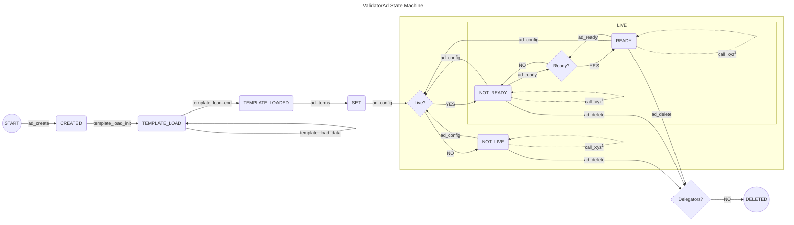

# State Machine of ValidatorAd

This file visualizes the state machine of the [ValidatorAd](/smart_contracts/validator_ad/contract.py) and describes the actions that can be taken.

# Notes:
(*)Any action that fails maintains the last state.

(**)Call of any action fails if not called from the state where it is explicitly allowed.

(1)Possible actions are:

- `ad_income`
- `ad_asa_close`
- `ad_self_disclose`
- `ad_terms`

- `breach_limits`
- `breach_pay`
- `breach_suspended`

- `contract_claim`
- `contract_expired`
- `contract_withdraw`
- `contract_delete`
- `contract_report_expiry_soon`

- `keys_confirm`
- `keys_not_confirmed`
- `keys_not_submitted`
- `keys_submit`

(2)Possible actions are:

- all from (1)
- `contract_create`

# List of actions

Below is a list of all possible actions to transition between states.
A description of each action is added.

All actions can be called only by the `Noticeboard` platform.

The following actions are related to the management of a validator ad.

- `ad_create`:  
Requires as input: an address.  
Creates the validator ad.  
Sets as the validator owner address the address given in the input.  
Sets the app ID of the `Noticeboard` platform to the caller application.  
Initializes validator ad's ALGO earned total amount and ALGO earned fees amount with zeros.  
Sets the contract state to `CREATED`.  
Returns: the created contract app ID.  

- `ad_config`:  
Requires as input: an address, (new) manager account, (new) liveliness status, and (new) maximum number of accepted delegators.  
Succeeds only if called by the contract creator.  
Fails if called from `CREATED` or `TEMPLATE_LOAD` or `TEMPLATE_LOADED` state.  
Fails if the address given in the input does not equal the validator owner account.  
Sets all the operation configuration parameters for the validator ad, i.e. the validator manager account, the status whether the ad is live to accept new delegators (`LIVE`) or not (`NOT_LIVE`), and the maximum number of delegators the validator can accept.  
Checks that the validator ad has enough memory to store the requested maximum number of delegators the validator wants to accept.  
*Note: The validator manager account has the sole rights to submit participation key information for a newly created delegation contract.*  
Returns: nothing.  

- `ad_delete`:  
Requires as input: an address.
Succeeds only if called by the contract creator.  
Deletes box with delegator contract template.  
Deletes the ad.  
Fails if the address given in the input does not equal the validator owner account.  
Fails if the ad has any active delegation contracts.  
Fails if the counter of asset types stored is not zero *(to prevent deletion by mistake)*.  
Fails if available ALGO balance is not zero (i.e. balance minus MBR).   
Closes the account to the validator owner account to return the MBR.  
Returns: nothing.  

- `ad_ready`:  
Requires as input: an address, and a readiness flag.  
Succeeds only if called by the contract creator.  
Fails if not called from `NOT_READY` or `READY` state.  
Fails if the address given in the input does not equal the validator manager account.  
If readiness flag is set, sets the contract state to `READY`, otherwise to `NOT_READY`.  
Returns: nothing.  

- `ad_self_disclose`:  
Requires as input: an address, and self-disclosure information.  
Succeeds only if called by the contract creator.  
Sets all the self-disclosure information in the validator ad.  
Fails if the address given in the input does not equal the validator owner account.  
*Note: The information is not and cannot be verified.*  
Returns: nothing.  

- `ad_terms`:  
Requires as input: an address, (new) validator terms, and a payment transaction.  
Succeeds only if called by the contract creator.  
Fails if the address given in the input does not equal the validator owner account.  
Sets all the terms of the validator ad.
*Note: With this action, the validator agrees with the (new) terms.*  
Makes sanity checks on all the ad terms (e.g. that defined minimum contract duration is shorter than maximum contract duration).  
If asset type is not ALGO *(which has separate storage in global by default)*, checks if a storage for the requested asset type already exists on the validator ad.
If not, opt-in to the asset and create a storage box for the asset.  
Increments the counter of the number of assets types stored.  
Fails if the payment amount does not cover the increase in MBR.  
If current state is `TEMPLATE_LOADED`, moves to state `SET`.
*Otherwise, the current state is kept.*  
Returns: nothing.  

- `ad_income`:  
Requires as input: an address, and an asset type (i.e. ASA ID or ALGO).  
Succeeds only if called by the contract creator.  
Sends all available balance of the asset (minus MBR in case of ALGO) to the validator owner address.  
Fails if the address given in the input does not equal the validator owner account.  
Returns: earned amount.  

- `ad_asa_close`:  
Requires as input: an address, and an ASA ID.  
Succeeds only if called by the contract creator.  
Fails if the address given in the input does not equal the validator owner account.  
Fails if the validator ad does not have a zero number of active delegators.
*This is to ensure no delegator will generate income for this ASA in the future.*  
Fails if the ASA ID does not exist on the validator ad.  
Deletes the storage box for this ASA.  
Decrements the counter of the number of assets types stored.  
Sends all available balance of the ASA ID to the validator owner address, and closes out the asset.  
Returns: earned amount.  

- `template_load_init`:  
Requires as input: an address, size of the delegator contract template (in bytes), and a payment transaction.  
Succeeds only if called by the contract creator.  
Fails if the address given in the input does not equal the validator owner account.  
Fails if not called from `CREATED` state.  
Creates a box storage (initialized with zeros) of the size given in the input for the delegator contract template.  
Sets the contract state to `TEMPLATE_LOAD`.  
Fails if the input payment transaction does not cover the MBR increase of this contract.  
Returns: nothing.  

- `template_load_data`:  
Requires as input: an address, data chunk offset, and data chunk.  
Succeeds only if called by the contract creator.  
Fails if the address given in the input does not equal the validator owner account.  
Fails if not called from `TEMPLATE_LOAD` state.  
Replaces the data chunk into the delegator contract template box at the given data chunk offset.  
Returns: nothing.  

- `template_load_end`:  
Requires as input: an address.  
Succeeds only if called by the contract creator.  
Fails if the address given in the input does not equal the validator owner account.  
Fails if not called from `TEMPLATE_LOAD` state.  
Sets the contract state to `TEMPLATE_LOADED`.  
Returns: nothing.  

The following actions are related to the management of a delegator contract.

- `contract_create`:  
Requires as input: delegator contract manager address, contract beneficiary address, contract duration, maximum stake, partner address and its convenience commissions, a payment transaction, and a general transaction.  
Succeeds only if called by the contract creator.  
Fails if not called from `READY` state.  
... ... ... ... ...   
Calls `contract_create` on a delegator contract.
Provides as input: the delegator contract manager address, the contract beneficiary address, and the `Noticeboard` app ID.
A new delegator contract in `CREATED` state is created.
Receives: the app ID of the created delegator contract.  
... ... ... ... ...   
Sends a payment transaction to the created delegator contract for funding the contract and covering its opt-in costs for one ASA.  
... ... ... ... ...   
Fails if the input contract duration does not meet the ad terms.  
Calculates delegation terms based on validator ad terms and the given inputs.
This includes the operational fee charged per round, and the maximum allowed stake amount.  
Calculates conveniences fees charged by partner.
This includes the partner charge on the setup fee and the operational fee charged per round.  
Fails if the maximum stake input exceeds the limit defined in ad terms.  
... ... ... ... ...   
Calls `contract_setup` on the created delegator contract.
Provides as input: sha256 of terms and conditions, the general delegation terms, balance delegation terms, and contract duration.
The delegator contract sets the delegation terms and moves to `SET` state.
Receives: nothing.  
... ... ... ... ...   
Fails if the input general transaction is neither an ALGO payment nor ASA transfer transaction to this validator ad.  
Creates a transaction the same as the general transaction received just issued to the delegator contract.  
Calls `contract_pay` on the created delegator contract.
Provides as input: the created general transaction.
The delegator contract approves the payment of setup and operational fee and moves to `READY` state.
Receives: nothing.  
... ... ... ... ...   
Adds the created delegator contract in the list of contracts managed by this validator ad.  
Increments the number of delegators of this validator ad.  
Fails if the number of delegators is above the maximum number of delegators accepted by this ad.  
... ... ... ... ...   
Fails if the input payment transaction does not cover the MBR increase of this contract and the forwarded payment to the created delegator contract (i.e. for its MBR).  
Returns: the app ID of the created delegator contract.  

- `keys_confirm`:  
Requires as input: delegator contract manager address, and delegation app ID.  
Succeeds only if called by the contract creator.  
Fails if delegation app ID does not exist on the validator ad.  
..... ..... .....   
Calls `keys_confirm` on the delegator contract from the given input.
Provides as input: the delegator contract manager address.
The confirmation of setup is approved (i.e. the contract goes to `LIVE` state).
Receives: nothing.  
..... ..... .....   
Returns: nothing.  

- `keys_not_confirmed`:  
Requires as input: delegation app ID.  
Succeeds only if called by the contract creator.  
Fails if delegation app ID does not exist on the validator ad.  
..... ..... .....   
Calls `keys_not_confirmed` on the delegator contract from the given input.
Provides as input: nothing.
It is noted that keys have not been confirmed (i.e. the contract goes to `ENDED_NOT_CONFIRMED` state).
The operational fee is returned.
Receives: delegator manager address and the notification message.  
..... ..... .....   
Removes the delegator contract from the list of contracts managed by this validator ad.  
Returns: delegator manager address and the notification message.  

- `keys_not_submitted`:  
Requires as input: delegation app ID.  
Succeeds only if called by the contract creator.  
Fails if delegation app ID does not exist on the validator ad.  
..... ..... .....   
Calls `keys_not_submitted` on the delegator contract from the given input.
Provides as input: nothing.
It is noted that keys have not been submitted in time (i.e. the contract goes to `ENDED_NOT_SUBMITTED` state).
The setup and operational fee are returned.
Receives: delegator manager address and the notification message.  
..... ..... .....   
Removes the delegator contract from the list of contracts managed by this validator ad.  
Returns: delegator manager address and the notification message.  

- `keys_submit`:  
Requires as input: key submission address, delegation app ID, and key registration info.  
Succeeds only if called by the contract creator.  
Fails if delegation app ID does not exist on the validator ad.  
Fails if the key submission address does not equal the validator manager address.  
..... ..... .....   
Calls `keys_submit` on the delegator contract from the given input.
Provides as input: key registration info.
The information about the participation keys is recorded (i.e. the contract goes to `SUBMITTED` state).
The setup fee is transferred to the validator ad.
Receives: setup fee amount minus commission, paid commission amount, and its asset type (i.e. ASA ID or ALGO), and delegator manager address and the notification message.  
..... ..... .....   
Increases the validator ad's total amount of earnings and earned fees for the platform for the asset type.  
Returns: the delegator manager address and the notification message.  

- `breach_limits`:  
Requires as input: delegation app ID.  
Succeeds only if called by the contract creator.  
Fails if delegation app ID does not exist on the validator ad.  
..... ..... .....   
Calls `breach_limits` on the delegator contract from the given input.
Provides as input: nothing.
It is reported that a limit breach occurred.
Receives: max breached flag, claimed operational fee amount minus commission, paid commission amount, and its asset type (i.e. ASA ID or ALGO), delegator manager address and the notification message.  
..... ..... .....   
Increases the validator ad's total amount of earnings and earned fees for the platform for the asset type.  
If maximum number of breaches has been reached, it removes the delegator contract from the list of contracts managed by this validator ad, and decrements the number of delegators of this validator ad.
..... ..... .....   
Returns: max breached flag, claimed operational fee amount minus commission, paid commission amount, and its asset type (i.e. ASA ID or ALGO), delegator manager address and the notification message.  

- `breach_pay`:  
Requires as input: delegation app ID.  
Succeeds only if called by the contract creator.  
Fails if delegation app ID does not exist on the validator ad.  
..... ..... .....   
Calls `breach_pay` on the delegator contract from the given input.
Provides as input: nothing.
It is reported that a payment cannot be made because the payment asset on the delegator contract have been either frozen or clawed back (i.e. the contract goes to `ENDED_CANNOT_PAY` state).
Receives: delegator manager address and the notification message.  
..... ..... .....   
Removes the delegator contract from the list of contracts managed by this validator ad.  
Decrements the number of delegators of this validator ad.  
..... ..... .....   
Returns: delegator manager address and the notification message.  

- `breach_suspended`:  
Requires as input: delegation app ID.  
Succeeds only if called by the contract creator.  
Fails if delegation app ID does not exist on the validator ad.  
..... ..... .....   
Calls `breach_suspended` on the delegator contract from the given input.
Provides as input: nothing.
It is reported that the delegator beneficiary was suspended (i.e. the contract goes to `ENDED_SUSPENDED` state).
Receives: claimed operational fee amount minus commission, paid commission amount, and its asset type (i.e. ASA ID or ALGO), delegator manager address and the notification message.  
..... ..... .....   
Increases the validator ad's total amount of earnings and earned fees for the platform for the asset type.  
Removes the delegator contract from the list of contracts managed by this validator ad.  
Decrements the number of delegators of this validator ad.  
..... ..... .....   
Returns: claimed operational fee amount minus commission, paid commission amount, and its asset type (i.e. ASA ID or ALGO), delegator manager address and the notification message.  

- `contract_claim`:  
Requires as input: delegation app ID.  
Succeeds only if called by the contract creator.  
Fails if delegation app ID does not exist on the validator ad.  
..... ..... .....   
Calls `contract_claim` on the delegator contract from the given input.
Provides as input: nothing.
It is marked that the operational fee has been claimed up to the current round.
Receives: claimed operational fee amount minus commission, paid commission amount, and its asset type (i.e. ASA ID or ALGO).  
..... ..... .....   
Increases the validator ad's total amount of earnings and earned fees for the platform for the asset type.  
..... ..... .....   
Returns: claimed operational fee amount minus commission, paid commission amount, and its asset type (i.e. ASA ID or ALGO).  

- `contract_expired`:  
Requires as input: delegation app ID.  
Succeeds only if called by the contract creator.  
Fails if delegation app ID does not exist on the validator ad.  
..... ..... .....   
Calls `contract_expired` on the delegator contract from the given input.
Provides as input: nothing.
It is marked that the delegator contract has expired.
Receives: claimed operational fee amount minus commission, paid commission amount, and its asset type (i.e. ASA ID or ALGO), delegator manager address and the notification message.  
..... ..... .....   
Increases the validator ad's total amount of earnings and earned fees for the platform for the asset type.  
..... ..... .....   
Removes the delegator contract from the list of contracts managed by this validator ad.  
Decrements the number of delegators of this validator ad.  
..... ..... .....   
Returns: delegator manager address and the notification message.  

- `contract_withdraw`:  
Requires as input: delegator manager address, and delegation app ID.  
Succeeds only if called by the contract creator.  
Fails if delegation app ID does not exist on the validator ad.  
..... ..... .....   
Calls `contract_withdraw` on the delegator contract from the given input.
Provides as input: the delegator manager address.
It is marked that the delegator has withdrawn from the delegation contract (i.e. the contract goes to `ENDED_WITHDREW` state).
Receives: claimed operational fee amount minus commission, paid commission amount, and its asset type (i.e. ASA ID or ALGO).  
..... ..... .....   
Increases the validator ad's total amount of earnings and earned fees for the platform for the asset type.  
..... ..... .....  
Removes the delegator contract from the list of contracts managed by this validator ad.  
Decrements the number of delegators of this validator ad.  
..... ..... .....   
Returns: nothing.  

- `contract_delete`:  
Requires as input: delegator manager address, and delegation app ID.  
Succeeds only if called by the contract creator.  
..... ..... .....   
Calls `contract_delete` on the delegator contract from the given input.
Provides as input: the delegator manager address.
The delegator contract opts out of the provided ASAs, the balance is closed, and the contract is deleted.
Receives: returned remaining balance, and its asset type (i.e. ASA ID or ALGO).  
..... ..... .....   
Returns the released MBR from validator ad to the delegator manager.  
..... ..... .....   
Returns: returned remaining balance, and its asset type (i.e. ASA ID or ALGO).  

- `contract_report_expiry_soon`:  
Requires as input: value for how much before expiry can the notification be made and how often can it be repeated, and delegation app ID.  
Succeeds only if called by the contract creator.  
..... ..... .....   
Forwards the call to the delegator contract from the given input.
Provides as input: the input values for for how much before expiry can the notification be made and how often can it be repeated.
The delegator contract marks the time of this report and provides a message.
Receives: delegator manager address and the notification message.  
..... ..... .....   
Returns: nothing.  

